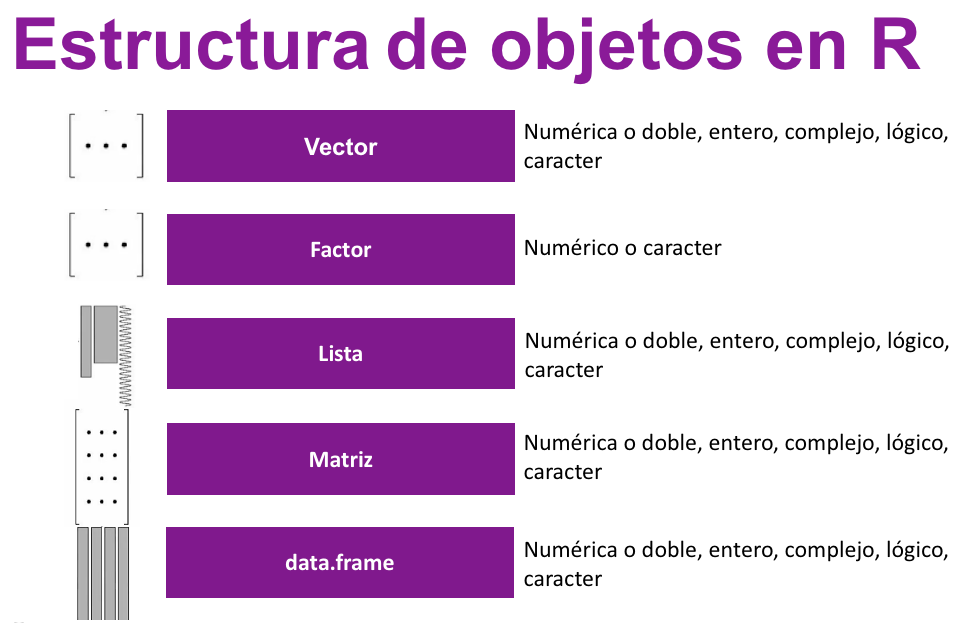
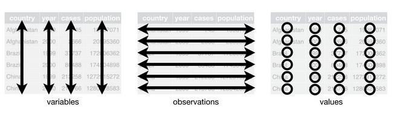

class: inverse, center, middle

# R 

##Es un lenguaje de programación funcional y orientado a objetos

---

```{r,echo=FALSE,fig.align='center',out.width='85%'}

```
---
# Matriz

Una matriz es una estructura de datos de dos dimensiones que contiene variables del mismo tipo. Por ejemplo: 

- Cadena de caracteres 
```{r, echo=FALSE, warning=FALSE}

v2<-c("R", "l", "a", "d", "i", "e", "s")
v3<-c("C", "u", "e", "r", "n","a","v","a", "c", "a")
v4<-c("R", "s", "t", "a", "t")
mat<-c(v2,v3,v4)
matrix(mat, 4,7, byrow = TRUE)
```
- Numérico 
```{r, echo=FALSE, warning=FALSE}
uno<-c(1,2,3,4,5)
dos<-c(6, 7, 8, 9, 10)
tres<-c(11,12,13,14,15)
cuatro<-c(16, 17, 18, 19, 20)
cinco<-c(21,22,23,24,25)
rbind(uno, dos, tres, cuatro, cinco)
```
- Lógico
```{r, echo=FALSE, warning=FALSE}
matrix(c(FALSE, TRUE, TRUE, FALSE), 2,2)
```
---
#¿Cómo crear una matriz en R?
-  Función: matrix()
-  Función: cbind()/rbind()
-  Función: frame_matrix()
-  Importar bases de datos
-  Coerción de objetos: as.matrix()
 
---
#Función: matrix ()
### Sintaxis

```{r}
matrix(data = NA, #objeto tipo vector
       nrow = 1,  # filas
       ncol = 1,  # columnas
       byrow = FALSE, # dirección de llenado
       dimnames = NULL) # lista con el nombre de las filas

```
###Ejemplo
```{r  }
datos <- c(1:6)      #crear un objeto de tipo vector
matrix(datos, 3,2)
```
---
### Cambiar las dimensiones de la matriz

```{r  }
matrix(datos, 3,2)
```
```{r  }
matrix(datos, 2,3)
```

### Llenado de matrices por filas
```{r}
matrix(datos,ncol = 2, byrow = TRUE) #cambiar a TRUE
```

---

#Función: cbind
### Sintaxis

```{r}
cbind(datos, NA )  
rbind(datos, NA)
```
---

Paso 1.- Crear los vectores
```{r}
x <- c(2, 7, 3, 6, 1)
y <- c(3, 7, 3, 5, 9)
```

Paso 2.- Combinamos objetos de clase vector, por columnas
```{r}
cbind(x, y)            
```

o... Combinamos por filas
```{r}
rbind(x, y)
```

---
###Agregar nombres 
A las filas, mediante la función rownames()
```{r}
un_vector<- c(4, 5, 1, 10, 8, 3)
B <- matrix(un_vector,nrow = 2,ncol = 3, byrow = TRUE)

rownames(B)<- c("fila1", "fila2")
B
```

Agregar nombres a las columnas usando la función colnames()
```{r}
colnames(B) <- c("columna 1", "columna 2", "columna 3")
B
```
---

###Atributos


```{r}
attributes(B)

```

  - dimensiones
```{r}
dim(B)
```

---

###Funciones más usadas en matrices

```{r, echo=FALSE}
library(knitr)
l0<- c("dim(), nrow(), ncol()", "Número de filas/columnas")
l1<-c("diag()", "Diagonal de una matriz") 
l2<-c("*", "Multiplicación elemento a elemento")
l3<-c("%*%", "Producto matricial")
l6<- c("cbind(), rbind()","Combinar columnas y filas")
l7<- c("t()","Matriz traspuesta")
l8<- c("solve(A)","Inverse de una matriz AAA")
l9<- c("solve(A, b)","Solución de Ax=bAx=bAx=b")
l10<- c("eigen()","Eigenvalues y eigenvectors")

Funciones<-as.data.frame(rbind(l0, l1, l2, l3, l6,l7,l8,l9,l10),  row.names = FALSE)
Funciones<-setNames(Funciones, c("FUNCION", "SIGNIFICADO"))

kable(Funciones
      #caption="Funciones más usadas en matrices"
      )
```
---

## Selección 
### Con el índice interno
Se accede a los elementos dentro de una matriz llamándola por su nombre y posteriormente usando el índice interno entre corchetes.
Nótese que del lado izquierdo del corchete se llaman a las observaciones, del lado derecho a las variables

matriz[izquierda, derecha]   
matriz[ obs  , var       ]   
matriz[ filas, columnas  ]  

```{r,echo=FALSE,fig.align='center',out.width='85%'}

```


---

###Ejemplo
Dada la siguiente matriz...
```{r, echo=FALSE}
my_matrix <- matrix(c(1, 5, 8, 1, 3, 2), 2,3)
my_matrix
```

```{r  }
#Elegir el primer elemento de la primera columna
my_matrix[1, 1] 

# Elegir el elemento de la segunda fila y tercer columna
my_matrix[2, 3] 
```

---
#Acceso a los elementos de las matrices en R

```{r}
#Elegir todos los elementos de la primera fila
my_matrix
my_matrix[1, ]
#Elegir todos los elementos de la primera columna
my_matrix[, 2] 
#Elegir primera y segunda columna, primera fila
my_matrix[1, 1:2] 
```
---

##Acceso a los elementos de las matrices en R

```{r}
#Primera y tercera columna, segunda fila
my_matrix[2, c(1, 3)]

#Todas las columnas excepto la segunda
my_matrix[, -2]

# ültima fila de una matriz
my_matrix[nrow(my_matrix), ] 

# Última columna de una matriz
my_matrix[, ncol(my_matrix)] 
```
---
#Selección 
### Por nombres
Cuando las variables y las filas de tu matriz están nombradas (headers), puedes utilizar estos nombres en lugar de la indexación interna.
```{r}
objeto_vector<-c(5, 3, 2, 52, 34, 12)
nombre_matriz <- matrix(objeto_vector, 
                        nrow = 2, 
                        ncol = 3, 
                        byrow = TRUE)

rownames(nombre_matriz) <- c("Row 1", "Row 2")
colnames(nombre_matriz) <- c("Column 1", "Column 2", "Column 3")

#Eligiendo los elementos de la primera fila, columna 1 y 3

nombre_matriz["Row 1", c("Column 1", "Column 3")]

```

---
#Matriz de tipo lógico
```{r}
vec_logico<-c(TRUE, TRUE, FALSE, TRUE)
matrix(vec_logico,ncol = 2)

```
#De tipo caracter
```{r}
my_matrix<-matrix(c("red", "green", "orange", "black"),
                  ncol = 2)
my_matrix
```

---
#DATAFRAMES

Un dataframe o marco de datos son bases de datos de dos dimensiones, con diferentes clases de variables.

- Cadena de caracteres y/o
- Numérico y/o
- Lógico

```{r,echo=FALSE,fig.align='center',out.width='85%'}

```

---
#¿Cómo crear un dataframe en R?
-  Función: data.frame()
-  Importar bases de datos
-  Coerción: as.data.frame()
 
---
##Función data.frame()

##Sintaxis
```{r}
data.frame(x, row.names = NULL, check.rows = FALSE,
           check.names = TRUE, fix.empty.names = TRUE,
           stringsAsFactors = default.stringsAsFactors())
```
---
##Ejemplo
```{r}
temperatura <- c(20.37, 18.56, 18.4, 21.96, 29.53, 28.16,36.38, 36.62, 40.03, 27.59, 22.15, 19.85)
humedad <- c(88, 86, 81, 79, 80, 78,71, 69, 78, 82, 85, 83)
lluvia <- c(72, 33.9, 37.5, 36.6, 31.0, 16.6,1.2, 6.8, 36.8, 30.8, 38.5, 22.7)
mes <- c("Enero", "Febrero", "Marzo", "Abril", "Mayo", "Junio","Julio", "Agosto","Septiembre", "Octubre", "Noviembre", "Diciembre")
Marco_de_datos <- data.frame(mes,temperatura,humedad,lluvia)
Marco_de_datos
```
```{r}
class(Marco_de_datos)
```


---
## Selección 
### Con el operador "$"
<p>
```{r}
Marco_de_datos$mes
```
```{r}
Marco_de_datos$temperatura
```
```{r}
Marco_de_datos$humedad
```

---
#LISTAS
```{r}

x <- 1:4
y <- 2:4
n <- 10
M <- c(10, 35)
#LISTA A PARTIR DE VECTORES
L1 <- list(x, y, n, M) 
L1
class(L1)
```
---
###Listas
```{r}
L2 <- list(A=x, B=y)
L2
class(L2)

```
---
#Cómo acceder a los elementos de L1?
```{r}
L1[[1]]
L1[[2]]
L1[[3]]
L1[[4]]

```

---
#Cómo acceder a los elementos de L2?
```{r}
L2$A
L2$B

```


###Ejercicios!!
---

# Contacto


Cristina Alejandra Domínguez Mendoza

cris_ale84@hotmail.com

